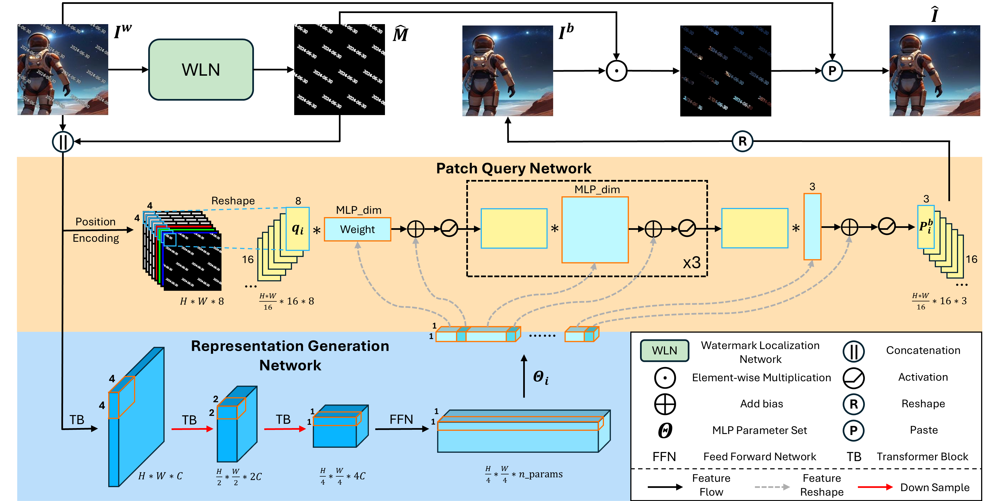
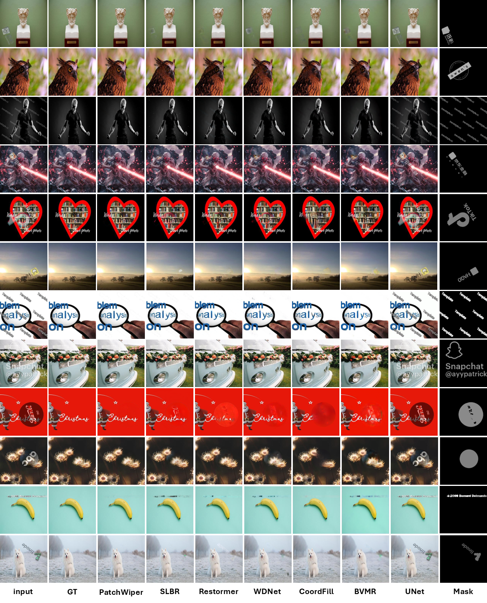

# PatchWiper
[ACM MM 2025] PatchWiper: Leveraging Dynamic Patch-Wise Parameters for Real-World Visible Watermark Removal


## Introduction

Official implementation of the following paper:

## PatchWiper Network



## Quick Start

### install

```
conda create -n PatchWiper python=3.11
conda activate PatchWiper
pip install -r requirements.txt
```

### Data Preparation

In this paper, we conduct all of the experiments on [PRWD](https://drive.google.com/file/d/1FS26k3e1ogjAmFz_Z2yfmXMpGhGd5SwV/view?usp=drive_link), [CLWD](https://drive.google.com/file/d/17y1gkUhIV6rZJg1gMG-gzVMnH27fm4Ij/view?usp=sharing) and ILAW. You can contact the authors of ILAW to obtain the dataset.


### Train and Test

- How to train my model?

  We provide an example of training bash for Watermark Localization Network and Restoration Network respectively: ```scripts/train_WLN.sh```, ```scripts/train_RestoreNet.sh``` 

  Please specify the checkpoint save path in ```--checkpoint_dir```, dataset path in ```--dataset_dir``` and Watermark Localization Network checkpoint path in ```--wln_ckpt```.

- How to test my model?

  We provide an example of test bash for whole PatchWiper: ```scripts/test.sh```.

  Please specify the checkpoint path in ```--ckpt_path``` and dataset path in ```--dataset_dir```.

- How to test on my data?

  We also provide an example of a custom data test bash: ```scripts/test_custom.sh```. You may put the images in ```custom/``` and run ```sh test_custom.sh```. Results can be found in ```custom/output/```


### Pretrained Model
Here is the model trained on PRWD dataset:

- [PatchWiper](https://drive.google.com/file/d/1fhbSgktTkp7DhfVkZ8yg3sR3AFAs-YiH/view?usp=drive_link)

- [Watermark Localization Network(WLN)](https://drive.google.com/file/d/18S5qVF9G8wBZ_kXiszYFVvReP7knZ-Wi/view?usp=drive_link)

## Visualization Results
We also show some qualitative comparision with state-of-art methods:



## **Acknowledgements**
Part of the code is based upon the previous work [SLBR](https://github.com/bcmi/SLBR-Visible-Watermark-Removal), [Restormer](https://github.com/swz30/Restormer) and [CoordFill](https://github.com/NiFangBaAGe/CoordFill).


## Citation
If you find this work or code is helpful in your research, please cite:

```
to be finished
```